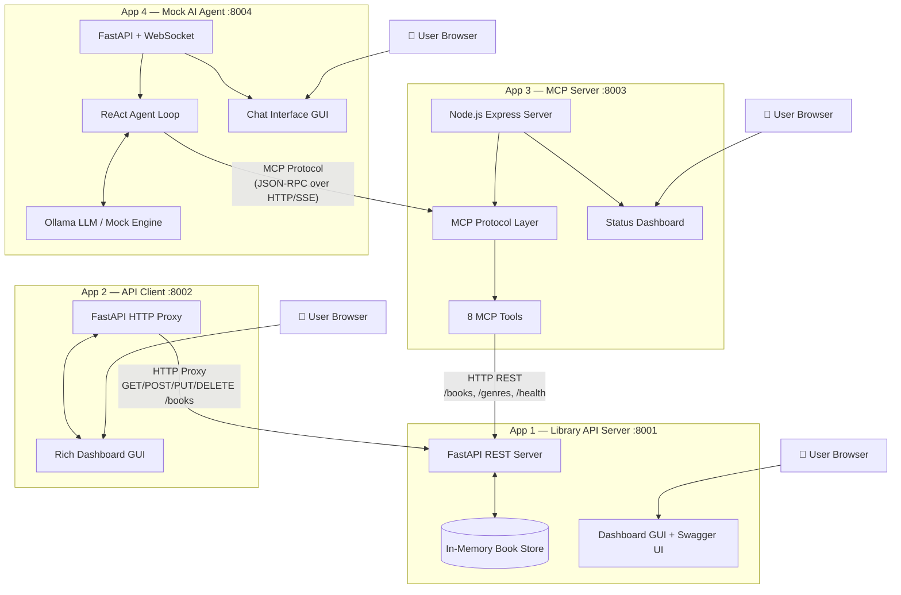
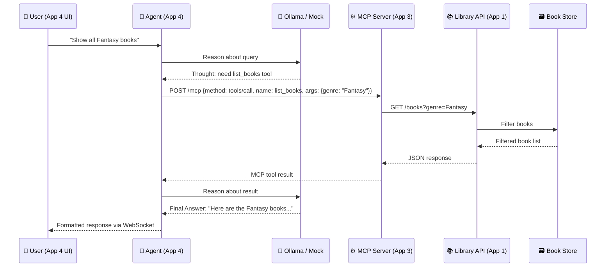
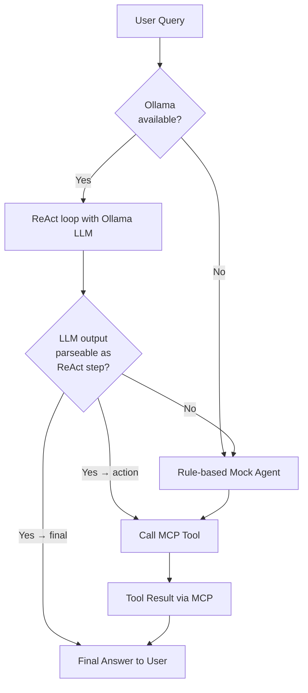
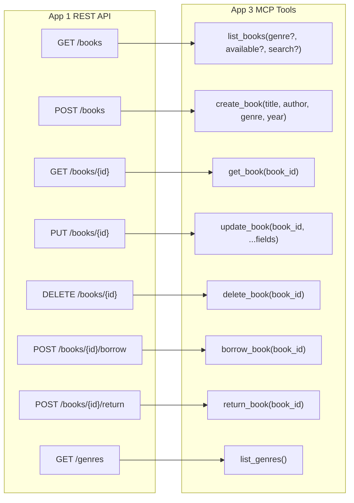
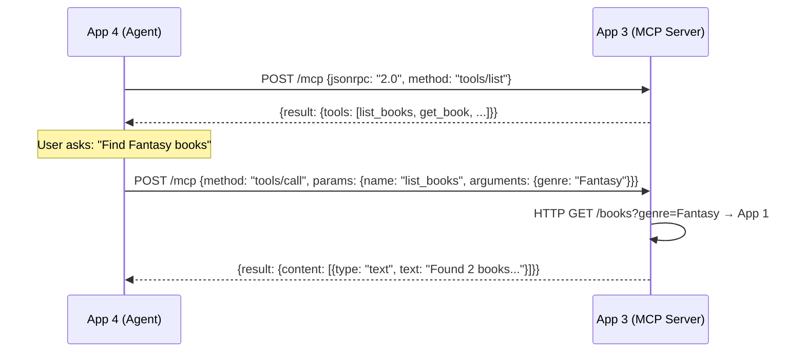

# Architecture

## API-2-MCP — System Architecture

This document describes the full architecture of the four-application demo system.

---

## High-Level Architecture

---

## Data Flow: User Query → Agent → MCP → API → Response

---

## Agent Resilience: LLM → Fallback Chain

When Ollama is running but returns output that cannot be parsed as a valid ReAct action (Thought / Action / Final Answer), App 4 transparently falls back to the rule-based mock agent to execute the most relevant MCP tool call and still returns a meaningful answer to the user.

---

## API-to-MCP Transformation

---

## MCP Protocol Flow

---

## Component Summary

| App | Technology | Port | Purpose |
|-----|-----------|------|---------|
| App 1 | Python / FastAPI | 8001 | REST API server for library books (CRUD + borrow/return) |
| App 2 | Python / FastAPI | 8002 | HTTP proxy client with rich dashboard GUI |
| App 3 | Node.js / TypeScript | 8003 | MCP server exposing App 1 APIs as 8 AI tools |
| App 4 | Python / FastAPI | 8004 | Mock AI agent with ReAct loop and chat GUI |

---

## Technology Stack

| Layer | Technology |
|-------|-----------|
| API Framework | FastAPI (Python) + Express (Node.js) |
| MCP SDK | @modelcontextprotocol/sdk v1.x |
| LLM | Ollama (llama3.2 locally) |
| Frontend | Vanilla HTML5 + Bootstrap 5 |
| Real-time | WebSocket (App 4 agent streaming) |
| Data Store | In-Memory (Python dict) |
| Process Management | Shell scripts + PID files |
